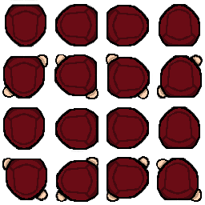

# Fallen

## Table of contents
- [Introduction](#introduction)
- [Features](#features)
    - [Core](#core)
        - [Object](#object)
        - [Sprite](#sprite)
        - [SpriteSheet](#spritesheet)
        - [Animatedsprites](#animatedsprites)
        - [SlicedSprite](#slicedsprite)
    - [UI](#ui)
        - [Canvas](#canvas)
        - [UIElement](#uielement)
        - [Image](#image)
        - [Button](#button)

<div style="page-break-after: always;">

## Introduction
Fallen is a 2D game framework written in C++ and made using the GLFW library.\
The framework started as a project for school but since then it has expanded to a learning tool for mechanics that I find interesting and useful.

<div style="page-break-after: always;">

## Features
This game framework uses a component system.

### Core

#### Object
The object class is abstract so you need to make a inherited version of this class or use one of the presets that are given.\
The object class has a few key methods and fields you should be aware of, like:
```cpp
Object* o = new Object();

// Add a component
o->AddComponent(new Image());

// Get the component that you just made and store it in a local variable
// Functions exactly the same as the GetComponent function in Unity
Image* i = o->GetComponent<Image>();

// Remove component from your object.
// Takes component pointer as argument. Can be combined with GetComponent<>().
o->RemoveComponent(o->GetComponent<Image>());

// Add a child to the object
// position, rotation and scale will be made to be exactly like its parent and changing the position, rotation and scale will only add or subtract from that original position.
o->AddChild(new Object());

// Get child of object by index returns object.
o->GetChild(0);

// Removes child from the object
// Argument can be the index or the pointer of the specific object
o->RemoveChild(0)

// Gives the parent of the object as Object*
Object* parent = o->parent;

// Transform has the position, rotation and scale
o->transform;
o->transform->position; // glm::vec3
o->transform->rotation; // float
o->transform->scale;    // glm::vec3

```

<div style="page-break-after: always;">

#### Scene
Scene is abstract.
Scene inherits from objects so it has all the capabilities of an object.
The only difference is that a scene has a camera.
#### Sprite
Basic sprite only has a filepath and you can change the UVs. texture/file has to be a .tga file
```cpp
// Give the path of the file as a parameter in your constructor
Sprite* sprite = new Sprite("yourspritepath.tga");

// Standard UVs are 1.0f, 1.0f
sprite->UV = glm::vec2(0.5f, 0.5f);
// With these UVs you can only see a quarter of the sprite/texture
```

#### SpriteSheet
You can use spritesheets for example buttons to change on hover, press and release.\
The constructor takes three parameters namely the filepath, the amount of sprites per row and the amount of rows.\
Or if you want to use the overloaded constructor you can also set the width and height of what is shown. For example if you want the frames to be a specific height they have to use this constructor.\
\
You can set the current frame that is shown and get it so that you can check in what state the spritesheet is. If you want to know what frame is what sprite you have to count from the top left.
if you use this spritesheet for example this is how you configure it.
<p align="center">
    
</p>

<div style="page-break-after: always;">

```cpp
SpriteSheet* spritesheet = new Spritesheet("yourspritepath.tga", 4, 4);

// Go to the second frame
spritesheet->SetCurrentFrame(2);

// Returns 2
int frame = spritesheet->GetCurrentFrame();
```
#### Animatedsprites
You can use spritesheets to animate your sprites.\
The constructor has one change from the spritesheet and that is how many seconds one frame lasts

```cpp
// first paramater is filepath
// second parameter is the amount of sprites are in a row (horizontal)
// third parameter is the amount of rows are in a column (vertical)
// fourth parameter is the amount of time between switching sprites in the animation
AnimatedSprite* sprite = new AnimatedSprite("yourspritepath.tga", 4, 4, 0.5f);

// To make an animation you have to set the animation frames
// This method takes a array of integers those integers represent the indices of the frames in the animation
// The indices start at the top left of the image
sprite->AddAnimation({1,2,3,4});

```

#### SlicedSprite
This sprite uses the nine slices technique to scale itself so that the corners do not stretch.\
The constructor takes 5 parameters: The filepath, size of the left side, size of the right side, size of the top side and the size of the bottom side. In that order. \
These sizes make it so that the program knows where the corners are and what not to scale.
```cpp
SlicedSprite* slice = new SlicedSprite("yourspritepath.tga", 40, 40, 40, 40);
```

#### Text
The constructor can take two parameters but the are not necessary those parameters are the path to a font and the font size if you want to change the font size you also have to fill in the font path.\
You can load in .ttf files for your own fonts

<div style="page-break-after: always;">

```cpp
// Standard font is roboto and the fontsize is 64
Text* text = new Text();
// Or
Text* text = new Text("yourfontpath.ttf");
// Or
Text* text = new Text("yourfontpath.ttf", 64);

// To set the text you have to use the text variable
text->text = "Hello world"
```


### UI
This UI framework makes it that anything that is a child of a canvas component will stay at that position no matter the size/resolution of the window.\
It is similar to how the UI in the Unity game engine would work.\

#### Canvas
If you want the UI framework you have to add the canvas component to the parent Object.\
\
Canvas has two constructors one takes two integers width and height and the other takes an glm::vec2 for the reference resolution so that it knows how to scale.\
\
If you choose the reference resolution it will automatically scale to your window size and scale every child accordingly so that the UI always looks the same.

```cpp
Canvas* canvas = new Canvas(1280, 720);
// Or
Canvas* canvas = new Canvas(glm::vec2(1280, 720));

// If you want to change if you want to scale with screensize or not later you can call
canvas->SetScaleWithScreenSize(true);

```
#### UIelement
With this component you can set the alignment to the left, right, top, bottom, topleft, topright, bottomleft and bottomright.

```cpp
// UI element has an alignment so that the framework knows which way you want the position to be calculated
// Center is the default
UIelement->SetAlignment(FallenUI::UIAlignment::Center);
```

#### Image
If you want to show a sprite/texture you have to add the image component. You can add the sprite after you called the constructor.
```cpp
Image* image = new Image();

// Add the sprite
image->AddSprite(new Sprite("yourspritepath.tga"));

// Change the image color to red
// Color blends with the textures color and the standard color is white
image->color = glm::vec4(255,0,0);
```

#### Button
Button component can be added to the object so that the object functions as a button can be controlled by keyboard but that is not the standard and not built in.\
\
Button has an overloaded constructor that takes two integers width and height. The default constructor uses the width and height of the texture if there is a texture attached.\
\
You can set the methods OnHover, OnPress and OnRelease
```cpp
Button* button = new Button();
// Or
Button* button = new Button(128, 256);

button->SetOnHover(std::bind(&ThisClass::OnHovered, this));
button->SetOnPress(std::bind(&ThisClass::OnPress, this));
button->SetOnRelease(std::bind(&ThisClass::OnRelease, this));

void ThisClass::OnHover()
{
    std::cout << "hovered" << "\n";
}

void ThisClass::OnPress()
{
    std::cout << "pressed" << "\n";
}

void ThisClass::OnRelease()
{
    std::cout << "released" << "\n";
}
```
